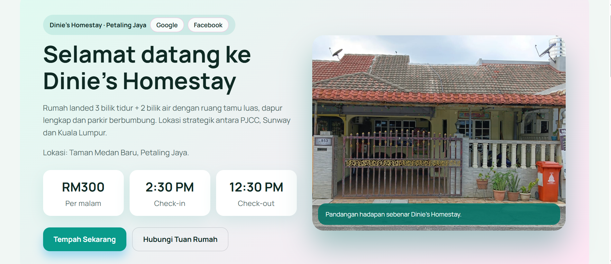

# Dinie Homestay Booking Management System

A web-based booking management system developed to simplify customer reservation processes for a homestay business. 
The application allows customers to browse available rooms, make reservations, complete payments, and receive booking 
confirmations through an intuitive web interface.

# Live Demo

🔗 https://tinyurl.com/diniehomestay

# Overview

This project was developed as part of my software development learning journey to strengthen my understanding of web development, database integration, and user interface design.

The system aims to provide a simple booking experience while allowing administrators to manage customer reservations efficiently.

# Features

# 1. Customer

- Browse available dates
- View house details
- Make reservations
- Payment page
- Booking confirmation

# 2. Administrator

- Manage bookings
- View reservation details
- Update booking records

# Technologies Used

Frontend

- HTML5
- CSS3
- JavaScript

Backend / Database

- Supabase

Development Tools

- Visual Studio Code
- Git
- GitHub

# Project Structure

- index.html
- booking.html
- payment.html
- confirmation.html
- admin.html
- app.js
- images/
- style.css

# Screenshots

# 1.Home Page

# 2. Booking Page

# 3. Payment Page

# 4. Confirmation Page

# 5. Admin Page

# Future Improvements

- User authentication
- Email confirmation
- Payment gateway integration
- Admin dashboard analytics

# Lessons Learned

Through this project I gained experience in

- Building responsive web pages
- Connecting a web application with Supabase
- CRUD operations
- JavaScript DOM manipulation
- Form validation
- User interface design
- Database management

# Developer

Nur Dinie Syafiqah Abd Majid

LinkedIn
https://linkedin.com/in/nurdiniesyafiqah

GitHub
https://github.com/diniesyafiqah
